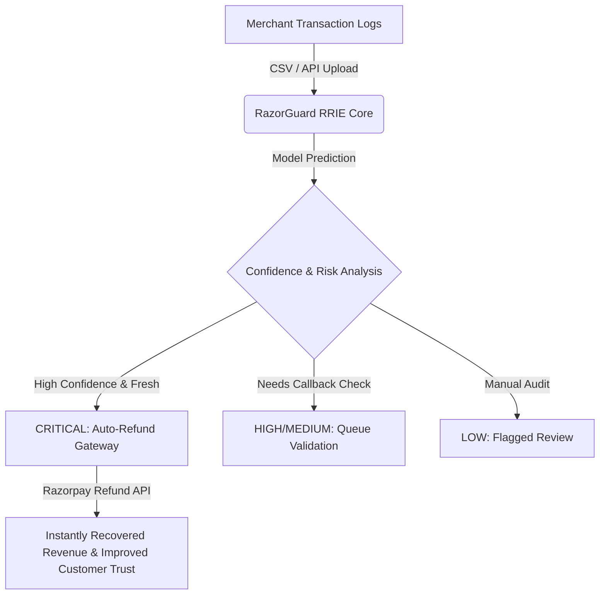

# 🛡️ RazorGuard — AI-Powered Revenue Recovery Engine

> **Razorpay Hackathon 2026** — An intelligent decision engine built to detect duplicate captures, categorize payment failures, score recovery probability, and automate financial reconciliation.

[](./web)
[](./app.py)
[](./web/app/globals.css)
[](./test_suite.py)

---

## 💡 The Problem: "Silent" Double Debits & Payment Churn
Modern payment rails (UPI, Card, Wallets) occasionally suffer from network retries, user double-clicks during UI freezes, or callback timeouts. In a standard checkout flow:
* A customer initiates a payment, suffers a gateway timeout, retries, and gets **charged twice** for a single checkout order.
* The merchant is left with **duplicate captures**, leading to high customer support overhead, dispute/chargeback fees, and brand damage.
* Detection usually happens days later via manual reconciliation.

**RazorGuard** transforms recovery from a reactive dispute process into an **Active Decision Engine**, catching duplicate captures immediately and suggesting automated resolution pathways based on machine learning scoring.

---

## ⚡ Key Capabilities & USPs

1. **Recovery Intelligence Engine (RRIE)**: Evaluates age, payment methods (UPI vs Card), amount brackets, and confidence factors to produce a **Recovery Probability Score (%)** and **ROI Score**.
2. **Revenue Mission Control Funnel**: Live telemetry visualizer charting transactional throughput:
   $$\text{Total Volume} \longrightarrow \text{Amount at Risk} \longrightarrow \text{Expected Recovery Value} \longrightarrow \text{Recovered Funds}$$
3. **AI Root-Cause Diagnostics**: Machine Learning rules classify anomalies into:
   * *Double-Click UI Freeze* (Gap $\le 5$s)
   * *UPI Intent Timeout Retry* (Gap $\le 30$s)
   * *Gateway Timeout Network Retry* (Gap $\le 60$s)
   * *Wallet Double-Debit* (Gap $\le 45$s)
   * *Multi-Tab Checkout* (Gap $\le 300$s)
4. **Instant Automated Refund Actions**: Directly hooks into Razorpay API endpoints using idempotency keys for instant reversals without human error.

---

## 📐 System Architecture



---

## 🚀 Deployment Guide

This project is a hybrid repository consisting of a **Next.js Web App** and a **Python Streamlit Dashboard**.

### 1. Deploying the Frontend (Next.js) to Vercel 🔼

Yes! You can directly upload and deploy the Next.js app to **Vercel** with these steps:

1. Push your repository to GitHub (already completed).
2. Go to [Vercel Dashboard](https://vercel.com/) and click **Add New > Project**.
3. Import the `Razorpay` repository.
4. **Important configuration setting**: In the project setup, set the **Root Directory** to `web`. Vercel will automatically detect Next.js settings and build dependencies inside the subdirectory.
5. Add your environment variables (like `NEXT_PUBLIC_API_URL` if connecting to your hosted backend) in Vercel settings.
6. Click **Deploy**.

### 2. Deploying the Backend Dashboard (Streamlit) 🐍

Since Streamlit is interactive Python, it requires a Python server. You can host it for free on **Streamlit Community Cloud** or **Render**:

* **Streamlit Cloud**:
  1. Go to [share.streamlit.io](https://share.streamlit.io/).
  2. Connect your GitHub repository.
  3. Select main branch, set Main file path to `app.py`.
  4. Click **Deploy**.

---

## 🛠️ Local Development Setup

To run both services locally on your machine:

### Python Dashboard Setup
```bash
# 1. Create and activate a virtual environment
python -m venv venv
.\venv\Scripts\activate   # On Windows
source venv/bin/activate  # On macOS/Linux

# 2. Install Python dependencies
pip install -r requirements.txt

# 3. Run the Streamlit dashboard
streamlit run app.py
```
*Access the dashboard at [http://localhost:8501](http://localhost:8501)*

### Next.js Sandbox Setup
```bash
# 1. Navigate to the web folder
cd web

# 2. Install Node dependencies
npm install

# 3. Run development server
npm run dev
```
*Access the sandbox UI at [http://localhost:3000](http://localhost:3000)*

---

## 🧪 Testing Suite
Execute the automated test suites using `pytest` to verify detection mechanics, API mocks, and metrics:
```bash
pytest test_suite.py -v
```

---

## 🏆 Hackathon Judges Highlights
* **Wow Factor**: The **Revenue Mission Control Funnel** is immediately visible above the tabs showing live merchant savings.
* **Premium UX**: High-fidelity dark mode with neon glassmorphism UI elements, smooth transitions, and hover-triggered dynamic shadows.
* **Realistic Scenarios**: Try loading the updated `sample_transactions.csv` to see how the engine handles realistic payment method differences and API actions.
